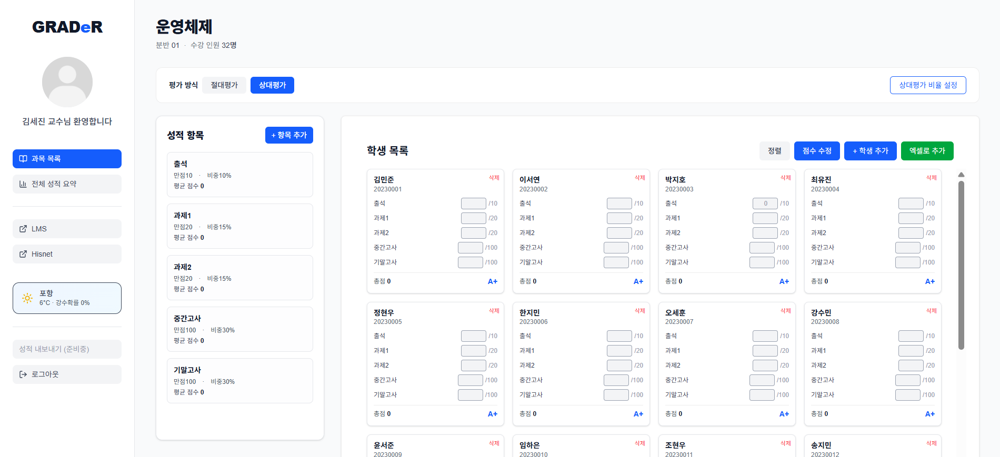
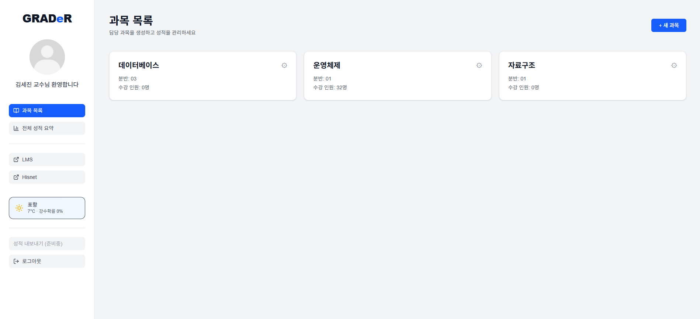

# Oss 팀 프로젝트 보고서

## 1. 프로젝트 개요

### 1-1. 서비스 설명

- 서비스명: GRADer_교수용 성적 관리 웹 서비스
- 서비스 대상 : 대학 교수들
- 서비스 목적: 기존 과목 관리 서비스인 lms 보다 정확하고 간편하게 학생들의 성적 관리를 도와주어 교수님들에게 성적 산출 과정에서의 편의를 제공합니다.
- 조원
    - 임한솔(22200628)
    - 손우진(22200387)
- 배포 URL
    - https://github.com/Hansol916/OSSFinal
    - https://oss-final-indol.vercel.app/

---

### 1-2. 서비스 주요 기능/특징

1. **과목 관리**
    1. 과목 생성
    2. 과목 별 분반 관리
    3. 과목 별 평가 방식 설정
    
    ㅇㅇ
    
2. **학생 관리**
    1. 학생 추가/삭제
    2. 과목 별 수강 학생 관리
    3. excel 파일로 학생 명단 import 
    
3. **성적 항목 관리**
    1. 성적 항목 추가/수정/삭제
    2. 항목 별 만점 점수 및 가중치 설정
    3. 가중치 합 검증
    
4. **점수 입력 및 성적 계산**
    1. 학생 별 항목 점수 입력
    2. 점수 입력 시 자동 저장
    3. 총점 자동 계산
    4. 평가 방식에 따른 최종 성적 자동 산출
    
5. **평가 방식**
    1. 절대 평가: 점수 구간 별 성적 부여
    2. 상대평가 : 교수가 직접 설정한 상위 퍼센트 기준으로 성적 부여

---

### 1-3. 참고 서비스

- 한동대학교 canvas LMS
    - 사이트의 좌측 사이드 바 리팩토링
    - 우측의 과목 카드 Grid를 학생 카드로 활용 예정
    - lms 기본 테마 색인 청색과 유사한 색상을 사용하여 교수 전용 UX 제작
    

---

### 1-4. API

- https://open-meteo.com/
    - Open-Meteo의 인증이 필요 없는 Open API를 활용하여 경상북도 포항 지역의 현재 기온과 강수 확률을 조회하였다.
    - 해당 데이터는 사이드바 하단에 표시하여 교수가 과목 관리 중 참고할 수 있는 보조 정보로 제공하였다.
    - API 호출은 페이지 로드 시 1회 수행되며, 불필요한 호출을 방지하였다.
- https://supabase.com/
    - CRud Data Set
        - 과목(Subjects)
        - 학생(Students)
        - 성적 항목(Categories)
        - 점수(Scores)
    - Next.js ApI Routes를 사용하여 Mock API 형태로 구현하였으며, Supabase와 연동하여 실제CRUD 동작을 수행한다.

## 2. 페이지(또는 컴포넌트)별 설명

### 2-1. Router에 포함된 LINK 별 화면 설명

- List 화면
    - 과목 목록 페이지
    
    <!--  -->
    

    
    과목 목록 페이지
    
    - 개설된 과목 목록을 카드 형태로 표시
    - 과목 선택 시 상세 페이지로 이동
- CRUD 기능 별 화면
    - 과목 상세 페이지(`/subjects/[id]`)
    
    
    
    과목 상세 페이지
    
    - 좌측: 성적 항목 관리
    - 우측: 학생 카드 목록
    - 학생 점수 입력/수정
    - 학생 추가 및 엑셀 업로드
    - 평가 방식 전환(절대/ 상대 평가)
    - Filter: 정렬 버튼으로 학번순, 성적 순으로 학생 카드 나열
- Components
    - Sidebar.tsx
        - 서비스 전역 네비게이션과 사용자 정보, 외부 링크(Hisnet, LMS) 및 날씨 정보 표시
    - CategoryPanel.tsx
        - 과목의 성적 항목(출석, 과제, 시험 등)을 목록으로 보여주고 항목 추가·수정·삭제를 관리
    - StudentGrid.tsx
        - 학생 카드 목록을 관리하는 컨테이너 컴포넌트로, 정렬·점수 수정 토글·학생 추가 기능을 담당
    - AddCategoryModal.tsx
        - 새로운 성적 항목을 추가하기 위한 모달 컴포넌트
        
        
        
        성적 항목 추가 모달
        
        
        
        성적 항목 수정 모달
        
    - StudentCard.tsx
        - 개별 학생의 점수 입력 UI와 총점 및 등급 정보를 표시
    - StudentAddModal.tsx
        - 학생을 수동으로 추가하기 위한 입력 모달 컴포넌트
        
        
        
        학생 추가 모달
        
    - StudentExcelButton.tsx
        - 엑셀 파일을 업로드하여 여러 명의 학생을 한 번에 추가하는 기능을 제공
    - SubjectAddModal.tsx
        - 새로운 과목을 생성하기 위한 입력 모달 컴포넌트
        
        
        
        과목 추가 모달
        
        
        
        과목 수정 모달
        
    - RelativeGradeCutModal.tsx
        - 상대평가 사용 시 학점별 비율을 설정하기 위한 모달 컴포넌트
        
        
        
        상대 평가 비율 설정 모달
        

---

### 2-2. 사용된 기술 설명

1. React Hooks
    1. useState
        - 컴포넌트 내부 상태 관리 사용
        - 학생 점수, 모달 열림 여부, 날씨 데이터 상태 등
    2. useEffect
        - 컴포넌트 마운트 시 API 호출 및 사이드 이펙트 처리
        - 날씨 Open API 호출, 초기 데이터 fetch 등
2. Next.js Hook, Utils
    1. useRouter(next/router)
        - 동적 라우트 파라미터(`id`) 접근
        - 페이지 이동 처리에 사용
    2. Link(next/link)
        - 클라이언트 사이드 네비게이션 처리
        - 페이지 이동 시 새로고침 없이 전환
3. UI 라이브러리
    1. Tailwind CSS
    2. lucide- react
        - SIdebar 요소에 아이콘 추가
        - 가볍고 직관적인 SVG 아이콘 제공
4. 외부 라이브러리
    1. Open- Meteo Open API
    2. XLSX 라이브러리
        - 엑셀 파일 파싱
5. HTTP 통신 방식
    1. Fetch API
        1. Next.js 환경에서 기본 fetch 사용
        2. API Routes와 통신하여 데이터 CRUD 수행
        3. Axios 대신 Fetch 사용으로 프로젝트 구조 단순화
6. 백엔드
    1. Supabase(PostgreSQL)
        - 학생, 과목, 성적 항목, 점수 데이터 저장
        - 관계형 테이블 구조를 활용한 성적 관리
        - 서버 전용 키(`superbaseAdmin`)을 통해 접근

---

## 3. 제작 과정

### 3-1. 조원 별 역할

- 임한솔
    - 프로젝트 전체 구조 설계
    - 라우팅 구조 설계
    - 과목 상세 페이지 제작
    - 엑셀 업로드를 통한 학생 일괄 추가 기능 구현
    - 학생 카드 CRUD 기능 구현
    - 프로젝트 배포 및 오류 수정
- 손우진
    - Supabase 스키마 설계, API 연동
    - Open API(Open-Meteo)를 활용한 날씨 정보 기능 구현
    - 사이드 바 및 공통 레이아웃 UI 제작
    - 과목 카드, 성적 항목 CRUD 기능 구현
    - 서비스 테스트 및 오류 피드백 제공

---

### 3-2. 팀 프로젝트 제작 소감

협업 동아리 PARD에서 서비스를 단기간에 제작하는 프로그램인 숏커톤의 경험을 살려서 이번 과제에서 서비스 기획부터 개발까지 큰 어려움 없이 할 수 있었다. 과제 수준의 사이트 보다 더욱 완성도있는 사이트를 제작하고 싶어서 꽤나 많은 시간을 투자했는데 나쁘지 않은 결과물이 나왔고 재밌게 개발하였다. 개발 과정에서 AI에게 많은 도움을 받았는데 현 시대에서 AI와 공생하는 것은 개발자에게 매우 중요한 자세인 것 같다. 하지만 언어의 문법, 기능을 완벽하게 알고 이해하며 전체적인 흐름을 아는 것이 기초가 되어야 AI에게 대체되지 않을 수 있다고 생각한다.

### 3-3. 향후 개선하고 싶은 부분

1. 성적 내보내기 기능 고도화
    - 현재는 성적 데이터를 화면에서만 관리할 수 있으나 향후 엑셀 및 PDF 형식으로 내보내는 기능을 추가하여 교수가 공식 성적 자료로 바로 활용할 수 있도록 개선하고 싶다.
2. Canvas LMS 연동
    - 현재는 엑셀 업로드를 통해 학생을 등록하지만 후에 LMS API와 연동하여 과목 수강생 정보를 자동으로 불러오는 기능을 추가하여 초기 설정 부담을 줄이고자 한다.
3. 성적 통계 및 시각화 기능
    - 학생들의 평균 점수, 분포, 성적 구간 비율 등을 그래프 및 차트 형태로 시각화하여 교수님께서 과목 전체의 성취도를 직관적으로 파악할 수 있도록 개선하고 싶다.